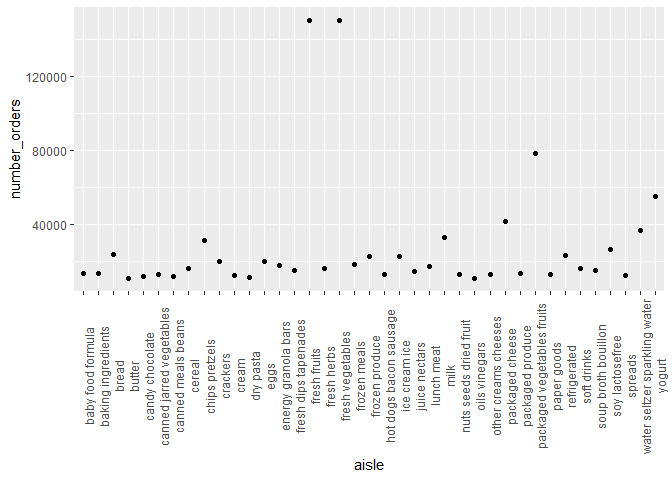

p8105\_hw3\_nk2814\_new
================
Naama Kipperman
10/13/2019

### Problem 1

Load the Instacart data and necessary packages you might need.

``` r
library(p8105.datasets)
library(tidyverse)
```

    ## -- Attaching packages --------------------------------------------- tidyverse 1.2.1 --

    ## v ggplot2 3.2.1     v purrr   0.3.2
    ## v tibble  2.1.3     v dplyr   0.8.3
    ## v tidyr   1.0.0     v stringr 1.4.0
    ## v readr   1.3.1     v forcats 0.4.0

    ## -- Conflicts ------------------------------------------------ tidyverse_conflicts() --
    ## x dplyr::filter() masks stats::filter()
    ## x dplyr::lag()    masks stats::lag()

``` r
library(dplyr)
data("instacart") 
```

**Write a short description of the dataset, noting the size and
structure of the data, describing some key variables, and giving
illustrative examples of observations.**

There are 1,384,617 observations in this instacart dataset and 15
variables - this dataset captures information about online grocery
orders placed by Instacart users. Each row in this dataset is a product
from a specific order. Examples of variables include order\_number,
product\_name, as well as variables that capture when the order was
placed, such as order\_dow and order\_hour\_of\_day. For example, a row
in this dataset could be an order of Bulgarian Yogurt that was placed at
10 pm on a Saturday, along with more details about that order (the
grocery aisle the product came from, whether it was re-ordered, etc.)

**How many aisles are there, and which aisles are the most items ordered
from?**

There are 134 distinct aisles. The aisles from which the most items are
ordered are ‘fresh vegetables’, ‘fresh fruits’, and ‘packaged vegetables
fruits’.

``` r
instacart %>% 
  janitor::clean_names() %>% 
  group_by(aisle) %>%
  summarize(
    number_orders=n()
  ) %>% 
  arrange(desc(number_orders))
```

    ## # A tibble: 134 x 2
    ##    aisle                         number_orders
    ##    <chr>                                 <int>
    ##  1 fresh vegetables                     150609
    ##  2 fresh fruits                         150473
    ##  3 packaged vegetables fruits            78493
    ##  4 yogurt                                55240
    ##  5 packaged cheese                       41699
    ##  6 water seltzer sparkling water         36617
    ##  7 milk                                  32644
    ##  8 chips pretzels                        31269
    ##  9 soy lactosefree                       26240
    ## 10 bread                                 23635
    ## # ... with 124 more rows

**Make a plot that shows the number of items ordered in each aisle,
limiting this to aisles with more than 10000 items ordered. Arrange
aisles sensibly, and organize your plot so others can read it.**

``` r
instacart %>% 
  janitor::clean_names() %>% 
  group_by(aisle) %>% 
  summarize(
    number_orders=n()
  ) %>% 
  arrange(desc(number_orders)) %>% 
  filter(number_orders > 10000) %>% 
  ggplot(aes(x=aisle, y=number_orders, fill=aisle))+
  geom_col()+ theme(axis.text.x = element_text(angle = 90))
```

<!-- -->

**Make a table showing the three most popular items in each of the
aisles “baking ingredients”, “dog food care”, and “packaged vegetables
fruits”. Include the number of times each item is ordered in your
table.**

``` r
instacart %>% 
  janitor::clean_names() %>% 
  group_by(aisle, product_name) %>% 
  summarize(
    number_orders=n()) %>% 
  arrange(aisle, desc(number_orders)) %>% 
  filter(aisle %in% c("baking ingredients", "dog food care", "packaged vegetables fruits")) %>% 
  top_n(n=3) %>% 
  knitr::kable()
```

    ## Selecting by number_orders

| aisle                      | product\_name                                 | number\_orders |
| :------------------------- | :-------------------------------------------- | -------------: |
| baking ingredients         | Light Brown Sugar                             |            499 |
| baking ingredients         | Pure Baking Soda                              |            387 |
| baking ingredients         | Cane Sugar                                    |            336 |
| dog food care              | Snack Sticks Chicken & Rice Recipe Dog Treats |             30 |
| dog food care              | Organix Chicken & Brown Rice Recipe           |             28 |
| dog food care              | Small Dog Biscuits                            |             26 |
| packaged vegetables fruits | Organic Baby Spinach                          |           9784 |
| packaged vegetables fruits | Organic Raspberries                           |           5546 |
| packaged vegetables fruits | Organic Blueberries                           |           4966 |

**Make a table showing the mean hour of the day at which Pink Lady
Apples and Coffee Ice Cream are ordered on each day of the week; format
this table for human readers (i.e. produce a 2 x 7 table)**

``` r
instacart %>% 
  filter(product_name %in% c("Pink Lady Apples", "Coffee Ice Cream")) %>%
  group_by(product_name, order_dow) %>% 
  summarize(
    mean_hour_ordered = mean(order_hour_of_day)
  ) %>% 
    mutate(order_dow=recode(order_dow,
       "0"="Sunday",
       "1"="Monday",
       "2"="Tuesday",
       "3"="Wednesday",
       "4"="Thursday",
       "5"="Friday",
       "6"="Saturday")) %>% 
  pivot_wider(
    names_from=order_dow,
    values_from=mean_hour_ordered
  ) %>% 
  knitr::kable()
```

| product\_name    |   Sunday |   Monday |  Tuesday | Wednesday | Thursday |   Friday | Saturday |
| :--------------- | -------: | -------: | -------: | --------: | -------: | -------: | -------: |
| Coffee Ice Cream | 13.77419 | 14.31579 | 15.38095 |  15.31818 | 15.21739 | 12.26316 | 13.83333 |
| Pink Lady Apples | 13.44118 | 11.36000 | 11.70213 |  14.25000 | 11.55172 | 12.78431 | 11.93750 |
